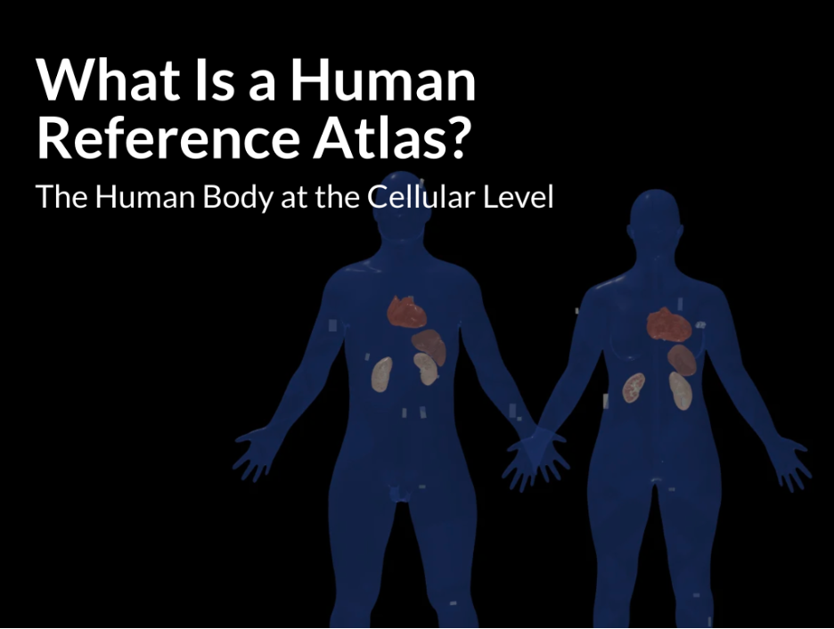

# Preview: Scrollytelling Series

HuBMAP Atlas Previews demonstrate functionality and resources that will become available in future HuBMAP portal releases. Previews may rely on externally hosted data or analysis results that were generated with processing pipelines that are not yet fully integrated into the HuBMAP data infrastructure.

## Description

The Scrollytelling Series is an engaging collection of interconnected stories designed to introduce the Human Reference Atlas (HRA) to a general audience. Starting from an accessible overview of the Atlas project, readers will be able to link to the HRA topics, concepts, and practices they wish to explore in more detail. All stories will utilize "scrollytelling" techniques that encourage reader participation and support knowledge retention through the use of mixed-media presentation.

Proposed topics for the Series include

- What Is an HRA (and Why Do We Really, Really Need One)?
- Get to Know Your Anatomical Structures!
- Shared Pathways: A Vasculature-Based Coordinate System
- Call in the Experts: Validating the Human Reference Atlas
- How to Identify and Locate Cell Type Populations
- Up Close and Virtual: Using the VR Organ Gallery for Teaching and Training
- What Is a Functional Tissue Unit?
- How All the Letters Connect: Making Sense of the ASCT+B Tables
- Who Uses the Human Reference Atlas and Why?

## Atlas Details

The Human Reference Atlas (HRA) aims to map all of the cells of the human body to advance biomedical research and clinical practice. Please see [Perspective paper](https://www.nature.com/articles/s41556-021-00788-6) that presents collaborative work by members of 16 international consortia on two essential and interlinked parts of the HRA: (1) three-dimensional representations of anatomy that are linked to (2) tables that name and interlink major anatomical structures, cell types, plus biomarkers (ASCT+B). The paper also discusses four examples that demonstrate the practical utility of the HRA.

## Contributors

##### **Story Development:** Katy Börner, Todd Theriault, and Sarah Davis

##### **Illustrations:** Sarah Davis

##### **Text:** Todd Theriault

## Attribution

| GROUP | CREATOR |
| --- | --- |
| MC-IU | Todd Theriault (ttheriau@indiana.edu) |
| MC-IU | Katy Börner (katy@indiana.edu) |

## Visualization

    <a target="_blank" href= https://a-cns_iu.vev.site/human-reference-atlas-test/ >
         </img>
    </a>

#####
