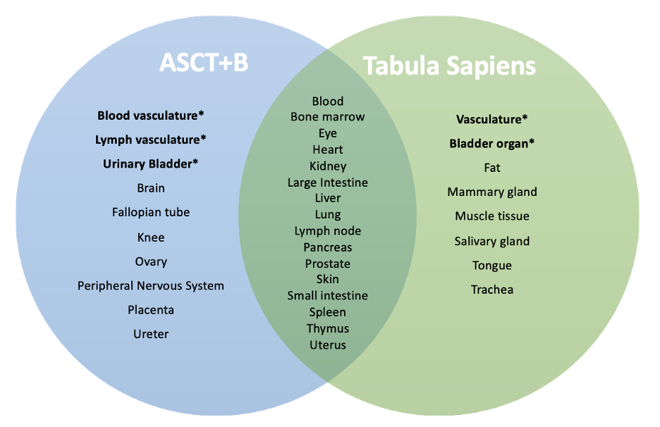
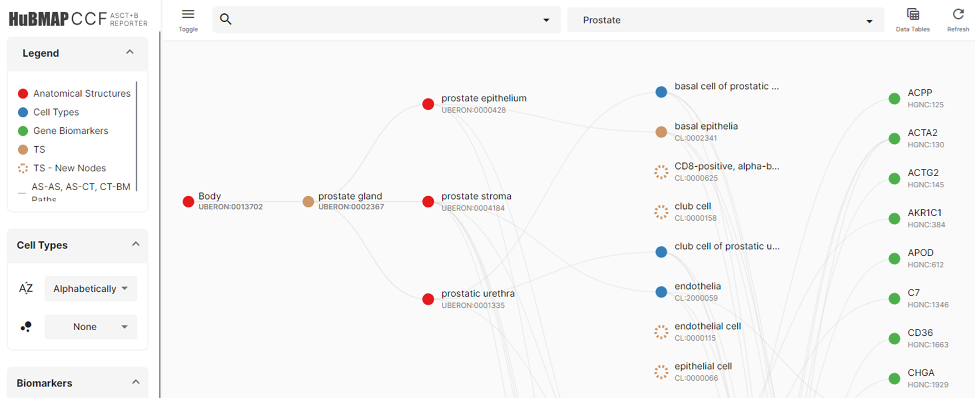
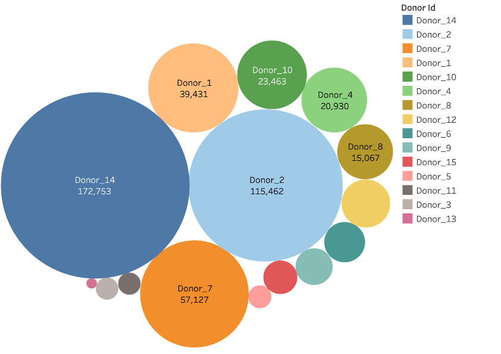

# Preview: Comparing Tabula Sapiens to the Human Reference Atlas

HuBMAP Atlas Previews demonstrate functionality and resources that will become available in future HuBMAP portal releases. Previews may rely on externally hosted data or analysis results that were generated with processing pipelines that are not yet fully integrated into the HuBMAP data infrastructure.
## Description
The “[Comparing Tabula Sapiens to the Human Reference Atlas](https://docs.google.com/document/d/1joDFF7A7T-3pbReEHI_oE4Zz1TpIC9l3F_71PXeX-78/edit?usp=sharing)” paper demonstrates how the Anatomical Structures, Cell Types, and Biomarker (ASCT+B) tables can be used to showcase contributions by the recently published Tabula Sapiens dataset—providing objective measures for tracking progress towards an accurate and complete human reference atlas (HRA). 

The Tabula Sapiens dataset is a single cell transcriptomic atlas that provides an integrated molecular reference of about 500,000 cells and 45 tissue blocks from 24 organs across 15 donors. The Tabula Sapiens dataset is unique as a large number of organs were sampled per donor enabling controlling for genetic background, age, environmental exposure, and epigenetic influences. 

The ASCT+B Reporter lets users explore the anatomical structures, cell types, and biomarkers, their interrelationships, and linkages to existing ontologies and supporting literature. It makes it possible to compare Tabula Sapiens data visually to the existing ASCT+B master tables and to report discrepancies that future ASCT+B table revisions might address, see **Fig. 2**  and [ASCT+B Reporter Comparison Preview](https://hubmapconsortium.github.io/hra-previews/pilots/pilot1.html). 
## Atlas Details

The Human Reference Atlas (HRA) aims to map all of the cells of the human body to advance biomedical research and clinical practice. Please see [Perspective paper](https://www.nature.com/articles/s41556-021-00788-6) that presents collaborative work by members of 17 international consortia on two essential and interlinked parts of the HRA:

1. Three-dimensional representations of anatomy that are linked to tables.
1. Tables that name and interlink major anatomical structures, cell types, plus biomarkers (ASCT+B). The paper also discusses four examples that demonstrate the practical utility of the HRA.

Data for 24 organs in Tabula Sapiens was compared to data for 26 organs covered in the ASCT+B tables. The overlap between both datasets is given in **Fig. 1**.  For details on methodology please consult [Comparing Tabula Sapiens to the Human Reference Atlas](https://docs.google.com/document/d/1joDFF7A7T-3pbReEHI_oE4Zz1TpIC9l3F_71PXeX-78/edit?usp=sharing).
## Experimental Data Details
The experimental data comparison presented here was documented by Sangmyung Lee during HuBMAP Summer 2022 Internship at Indiana University, see details in “[Comparing Tabula Sapiens to the Human Reference Atlas](https://docs.google.com/document/d/1joDFF7A7T-3pbReEHI_oE4Zz1TpIC9l3F_71PXeX-78/edit?usp=sharing)”.
## Contributors
**Tabula Sapiens Data:** [Authors on ](https://www.science.org/doi/10.1126/science.abl4896)[*Science* ](https://www.science.org/doi/10.1126/science.abl4896)[publication](https://www.science.org/doi/10.1126/science.abl4896)

**ASCT+B Master Tables:** [Human Reference Atlas Portal](https://hubmapconsortium.github.io/ccf/pages/ccf-anatomical-structures.html) links to all tables and their authors

**Comparison Data Visualizations:** Sangmyung Lee, Ellen Quardokus, Katy Börner, Vicky Daiya, Abraham Verdoes
## Attribution

|GROUP|CREATOR|
| :-: | :-: |
|MC-IU|Sangmyung Lee (sam.sangmyung@gmail.com)|
|MC-IU|Katy Börner (katy@indiana.edu)|
|MC-IU|Ellen Quardokus (ellenmq@indiana.edu)|

## Visualizations

 </img>
**Figure 1**. There is a partial overlap of the 26 organs covered in the ASCT+B tables and the 24 organs in Tabula Sapiens. For details on \* please consult (cite [Comparing Tabula Sapiens to the Human Reference Atlas](https://docs.google.com/document/d/1joDFF7A7T-3pbReEHI_oE4Zz1TpIC9l3F_71PXeX-78/edit?usp=sharing)).

 </img>
**Figure 2**. Comparison of Tabula Sapiens data to ASCT+B master tables using the ASCT+B Reporter, see also [ASCT+B Reporter Comparison Preview](https://hubmapconsortium.github.io/hra-previews/pilots/pilot1.html). 

 </img>
**Figure 3**. Bar graph visualization of cell type counts per shared organ.

 </img>
**Figure 4**. The Tabula Sapiens provides a total of 483,152 cells from 24 different organs across 15 donors

#####

#####

