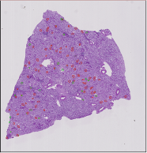
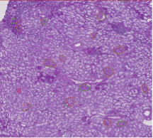

# Preview: FTU Segmentation 

HuBMAP Atlas Previews demonstrate functionality and resources that will become available in future HuBMAP portal releases. Previews may rely on externally hosted data or analysis results that were generated with processing pipelines that are not yet fully integrated into the HuBMAP data infrastructure.
## Description
This preview explains how Kaggle competition results are used to develop and optimize machine learning algorithms that can segment functional tissue units (FTUs) defined here as the smallest level of tissue organization (i.e., a cell population neighborhood) that performs an organ’s major physiological function.

The winning model “Tom” from the “[HuBMAP - Hacking the Kidney](https://www.kaggle.com/c/hubmap-kidney-segmentation)” Kaggle competition was validated by MC-IU and productized by Matt Ruffalo at TC-CMU. The code reads kidney Periodic Acid-Schiff (PAS) stained whole slide images (WSIs) and predicts renal corpuscle (also called glomeruli) segmentation masks, see example below. FTU segmentations are crucial for Human Reference Atlas construction and usage. The HIVE infrastructure productizes robust and generalizable code that meets FAIRness goals and can be reliably run at scale. 

Instead of ingesting manually generated or computed segmentation masks for tissue data, HIVE’s strong preference is to encode expert knowledge as a machine learning model that can be run in a consistent manner over all existing and future tissue data. To accomplish this, machine learning models are trained, validated, and then containerized and added as a computational pipeline applicable to appropriate data types/tissues. This approach allows detailed tracking of dataset provenance and allows users to run containerized workflows to reproduce results. 
## Atlas Details
The Human Reference Atlas (HRA) aims to map all of the cells of the human body to advance biomedical research and clinical practice. Please see [Perspective paper](https://www.nature.com/articles/s41556-021-00788-6) that presents collaborative work by members of 17 international consortia on two essential and interlinked parts of the HRA.

In order to construct the HRA, we are interested in capturing major anatomical structures and cell types for key FTUs. For each major FTU there exists information on its anatomical structures, cell types, and biomarkers in the ASCT+B tables and a 2D illustration that characterizes the general number, size, shape, and spatial location of cell types to each other.  

The value of FTUs is acknowledged by the scientific and medical communities, yet limited data exists about human diversity (e.g., the number and size distribution of FTUs for a single organ and across individuals with different age, sex, body mass index [BMI]). A key reason for this knowledge gap is the fact that manual segmentation of FTUs is time consuming, expensive, and does not scale to the enormous amount of data now available. 

Kaggle teams participating in the competition performed many iterations of experimentation in an extremely collaborative manner, sharing resources, ideas, and code to arrive at highly efficient solutions. The participants included academic researchers, data scientists, and machine-learning engineers from all over the world. 

Resulting segmentation masks can be used to compute the number of glomeruli per unit area and changes as we age, see first results in <https://www.nature.com/articles/s42003-023-04848-5>.
## Experimental Data Details
The experimental data used here is detailed in the Kaggle competition (<https://www.kaggle.com/competitions/hubmap-kidney-segmentation/data>) and the associated paper (<https://www.nature.com/articles/s42003-023-04848-5>).
## Contributors
**Kidney Data:** Jeff Spraggins, Heath Patterson (TMC-VU)

**Kaggle Competition and Model Validation:** Yashvardhan Jain, Leah Godwin, Yingnan Ju, Naveksha Sood,** Katy Börner (MC-IU)

**Model Productizing:** Matt Ruffalo, Sean Donahue (TC-CMU)
## Attribution

|GROUP|CREATOR|
| :-: | :-: |
|
MC-IU

|Yashvardhan Jain (<yashjain@iu.edu>), Katy Börner (<katy@indiana.edu>)|
|TC-CMU|Matt Ruffalo|

## Visualization
Exemplary tissue section at three zoom levels from HuBMAP PAS Kidney image used in the Kaggle competition with ground truth FTU (Glomeruli) segmentations outlined in red and the predictions made by the winning model (Tom) in green. Interactive visualization can be accessed at: <https://cns-iu.github.io/ccf-research-kaggle-2021/kidney_tom_viz.html> 

  

    
  

  

    
  

  

    
  

  

